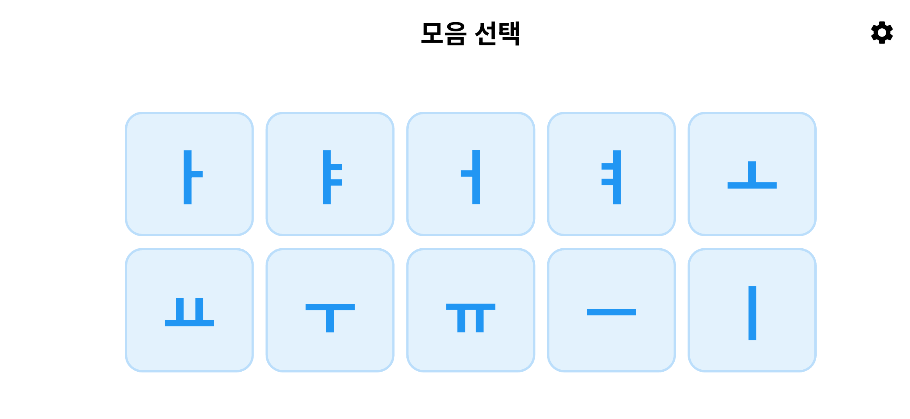
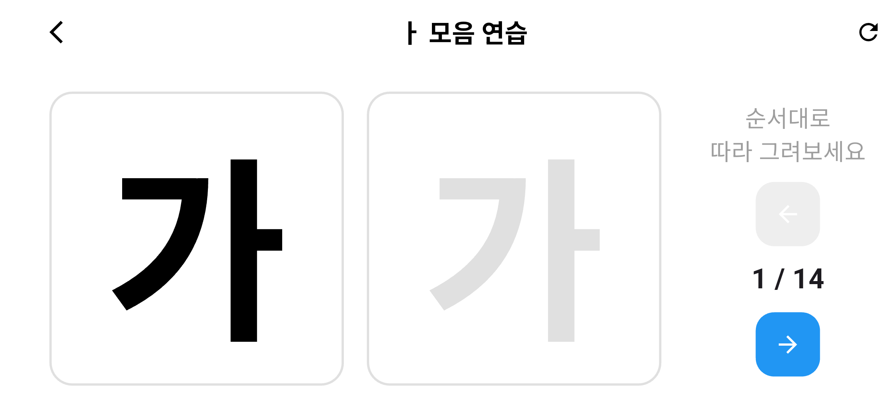

# 한글 모음 따라쓰기 학습 앱 (Hangul Vowel Tracing App)

Flutter로 개발한 **한글 모음 기반 따라쓰기(트레이싱) 학습 앱**입니다.  
모음을 선택하면 해당 모음이 포함된 기본 한글 음절(받침 없음)을 순서대로 보여주고, 사용자가 직접 손가락으로 따라 그리며 학습할 수 있습니다.

유아·초등 저학년 한글 학습, 태블릿 기반 교육용 앱을 목적으로 설계되었습니다.

---

  
  
  

---

## 주요 기능

### 1. 모음 선택
- ㅏ, ㅑ, ㅓ, ㅕ, ㅗ, ㅛ, ㅜ, ㅠ, ㅡ, ㅣ
- 5 × 2 그리드 레이아웃
- 태블릿·가로모드에 최적화된 UI

### 2. 한글 따라쓰기 (Tracing)
- 선택한 모음을 포함한 **받침 없는 기본 음절 자동 생성**
- 왼쪽: 본보기 글자 (고정, 검정색)
- 오른쪽: 따라쓰기 영역 (드로잉 가능)
- 드래그로 실시간 필기

### 3. 글자 순차 학습
- 이전 / 다음 버튼으로 음절 이동
- 현재 학습 진행도 표시 (예: `3 / 14`)

### 4. 설정 기능
- 펜 두께 조절
- 펜 색상 변경
- 따라쓰기 가이드 글자 표시 / 숨김

### 5. 학습 보조 기능
- 다시 쓰기 (캔버스 초기화)
- 전체화면 (immersive mode)
- 가로 화면 고정
